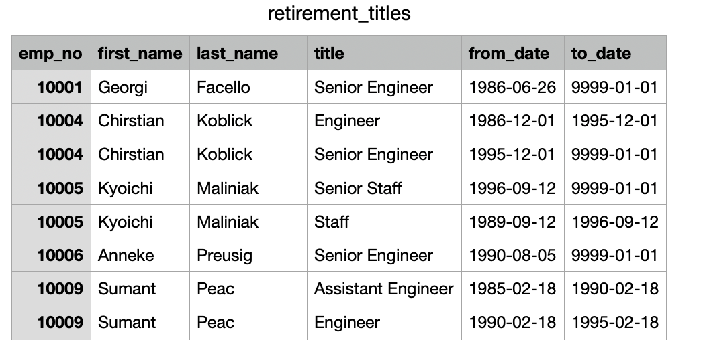
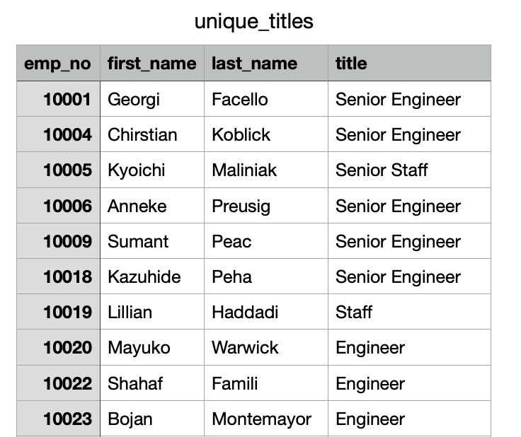
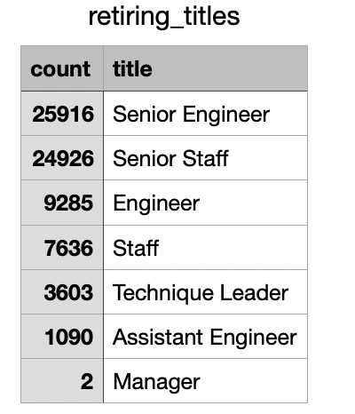
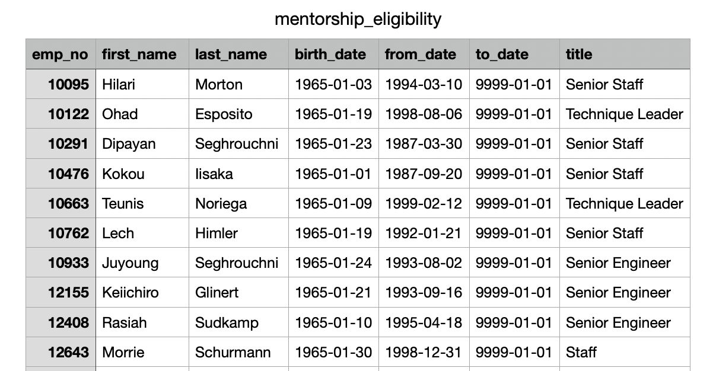

# Pewlett-Hackard-Analysis

## Overview

Using employee records and data, Pewlett- Hackard asked for help performing employee research to determine the amount of employees retiring per title and the employess eligible to participate in a mentorship program. With thousands of employees getting ready to reach retirement age, the anaylsis perfomed showcased all eligible employees who could be part of the "silver tsunami" exiting the workforce. 

## Results

The first table created to list the employees who could be part of the "silver tsunami" wave returned multiple duplicates for employees, due to employees being listed under different titles. 

Then using the `DISTINCT ON` statement, a filter was applied to sort through employees using their employee number to remove the duplicates.

A count was done to determine the number of employees filtered by job title who have the potential to join the "silver tsunami" exiting the workforce. That count was determined to be roughly 72,458.

A table was created to determine the names of employees and their titles that were eligible to participate in a Mentorship Program. The count of eligible employees was determined to be 1,549. 

## Summary

From the analysis above, it was determined that as the "silver tsunami" begins to make its impact, roughly 72,458 roles will need to be filled at Pewlett-Hackward. Based on the eligibity criteria given by Pewlett-Hackward, only 1,549 employees are eligible to participate in a mentorship program. When compared with the roughly 72,000 that will be retiring, that is not enough qualified, retirement-ready employees to mentor the new generation. 

### For Further Consideration
